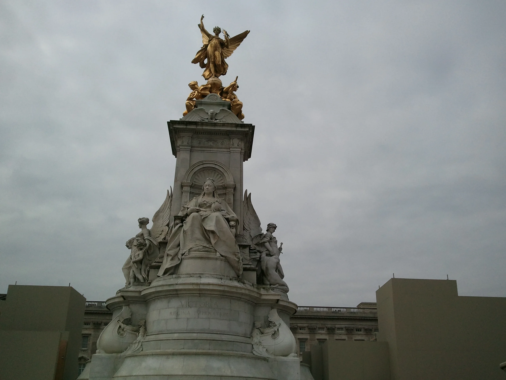
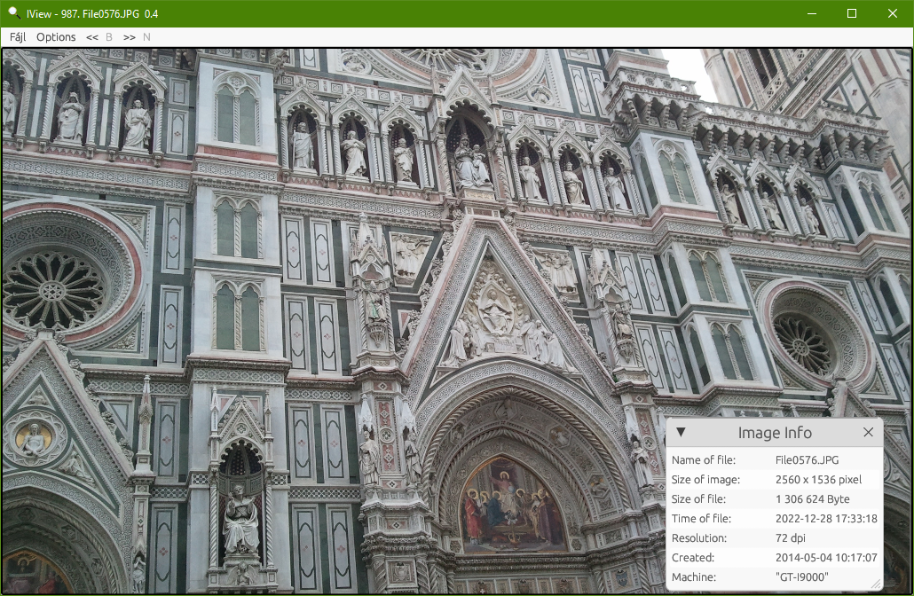
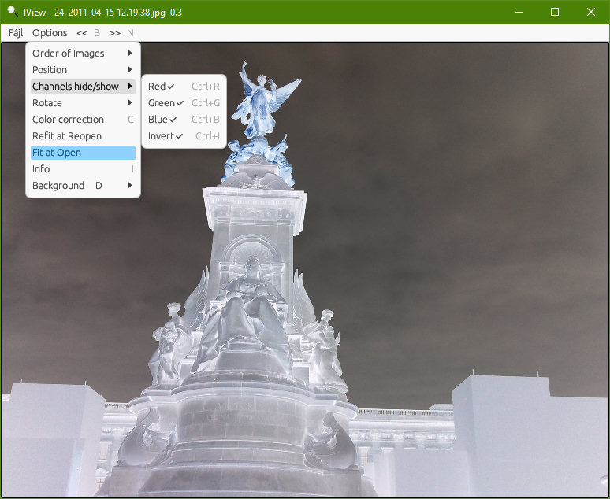
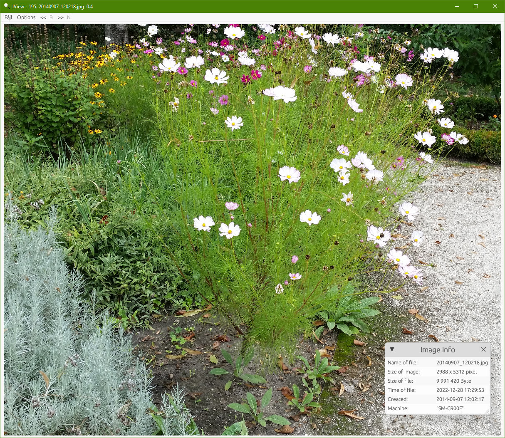

# 🖼️ IView Project

🇺🇸 A high-performance image viewer application built with Rust and egui.
🇭🇺 Egy nagy teljesítményű képnézegető alkalmazás Rust és egui alapokon.

---

## 🇭🇺 Magyar leírás

Az **IView** egy sokoldalú képnézegető alkalmazás, amely számos hasznos kiegészítő funkcióval segíti a képek kezelését és alapvető szerkesztését, kihasználva a Rust sebességét és biztonságát.



### Főbb funkciók:
*   **📂 Böngészés:** Képek megtekintése egy adott könyvtárban, előre-hátra léptetéssel és különböző rendezési szempontok alapján.
*   **📋 Vágólap kezelés:** 
    *   Vágólapon lévő képek közvetlen megjelenítése.
    *   A megnyitott kép vágólapra másolása.
*   **💾 Konvertálás:** Képek mentése különböző formátumokba: `JPG`, `PNG`, `BMP`, `TIF`, `GIF`, `WEBP`.
*   **🎨 Képmódosítások:**
    *   **Nagyítás/Kicsinyítés:** Skálázható méret 0.1-től egészen 10-es szorzóig.
    *   **Forgatás:** Gyors elforgatás (0°, 90°, 180°, 270°).
    *   **Képkorrekció:** Gamma, kontraszt és világosság állítási lehetőség.
    *   **Színkezelés:** Színcsatornák (R, G, B) egyenkénti ki/be kapcsolása és inverz megjelenítés.
*   **⚙️ Speciális funkciók:**
    *   Részletes képinformációk és metaadatok megjelenítése.
    *   **Geolokáció:** Tárolt GPS koordináták megnyitása közvetlenül a Google Maps alkalmazásban.
    *   **GPU Optimalizálás:** A túl nagy panorámaképek automatikus átméretezése a grafikus processzorok (GPU) által megkövetelt maximum 16384 x 16384 képpontos méretre.

---

## 🇺🇸 English Description

**IView** is a versatile image viewer application designed to provide efficient image management and basic editing tools, leveraging the performance and safety of the Rust ecosystem.



### Key Features:
*   **📂 Image Browsing:** View images within a specific directory with forward/backward navigation and various sorting options.
*   **📋 Clipboard Integration:**
    *   Display images directly from the clipboard.
    *   Copy the currently displayed image to the clipboard.
*   **💾 Export & Convert:** Save loaded images in multiple formats, including `JPG`, `PNG`, `BMP`, `TIF`, `GIF`, and `WEBP`.
*   **🎨 Image Manipulation:**
    *   **Zooming:** Scaling options ranging from 0.1x up to 10x.
    *   **Rotation:** Quick fixed-angle rotation (0°, 90°, 180°, 270°).
    *   **Adjustments:** Fine-tune Gamma, Contrast, and Brightness.
    *   **Color Tools:** Toggle individual color channels (RGB) or apply color inversion.

*   **⚙️ Advanced Features:**
    *   Display detailed image metadata and technical information.
    *   **Geolocation:** View stored location data directly in Google Maps.
    *   **GPU Optimization:** Automatic resizing of oversized panoramic images to the hardware-standard maximum of 16384 x 16384 pixels for stable GPU rendering.

---

### 🛠 Tech Stack / Technológiai háttér

*   **Language:** [Rust](https://www.rust-lang.org)
*   **UI Framework:** [eframe] / [egui] 

*   **Cross-platform:** Tested and working on Windows 10 and Linux (Linux Mint).

### 🚀 Development / Fejlesztés

```bash
# Build and run the project
# Projekt fordítása és futtatása
cargo run --release
```
